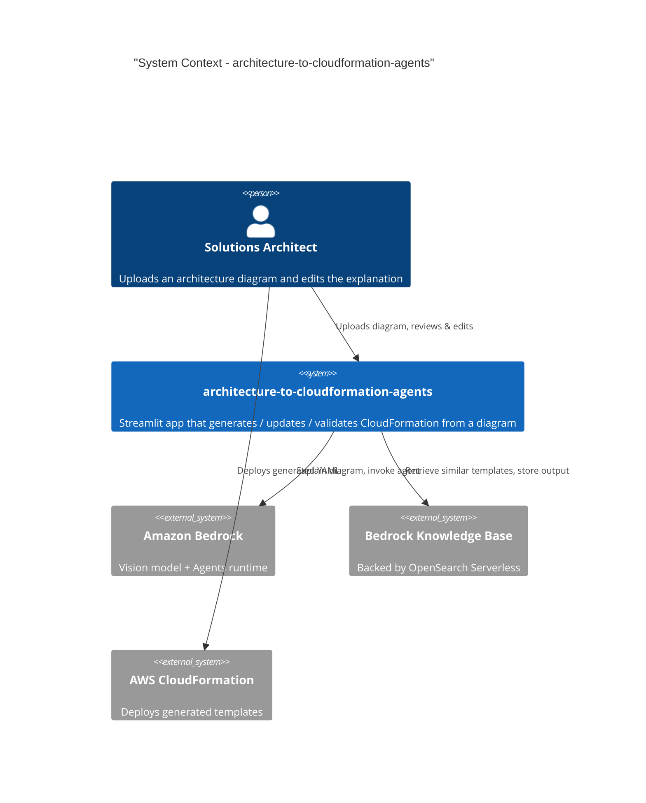
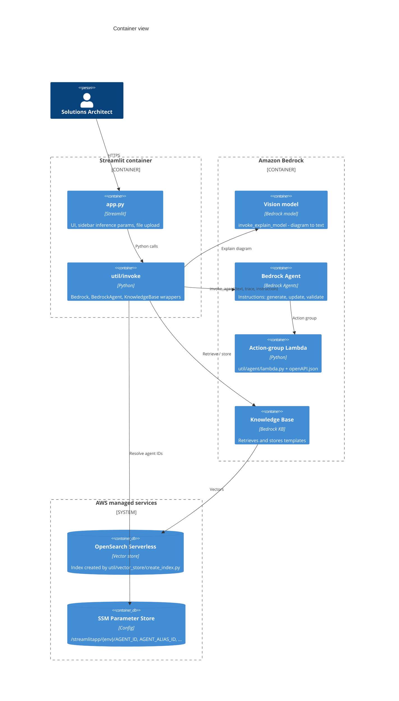
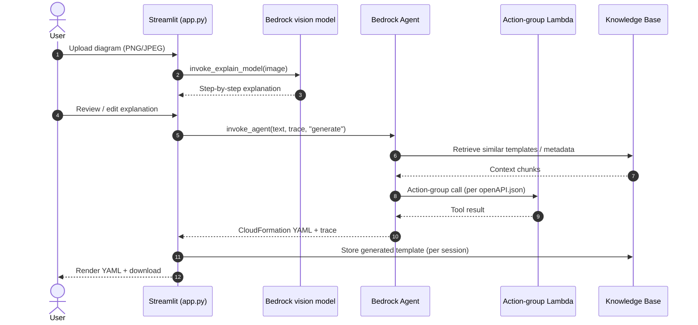

# Architecture

This document uses a **C4-style description with Mermaid diagrams**
(option b from the architecture-decision spec) rather than a prose-only
narrative. The system has clearly separable components and three distinct
flows (`generate`, `update`, `validate`), so a Context diagram, a Container
diagram, and a sequence diagram render the design more usefully than prose
alone. Mermaid renders on GitHub for the diagram types used here; the C4
shorthand is still flagged as experimental upstream, so verify rendering on
the PR preview before relying on it.

## Overview

`architecture-to-cloudformation-agents` is a Streamlit application that
turns an uploaded architecture diagram (PNG/JPEG) into a working AWS
CloudFormation template. A vision model on Amazon Bedrock first explains the
diagram in natural language; an Amazon Bedrock Agent then generates,
updates, or validates the corresponding CloudFormation YAML. A Bedrock
Knowledge Base backed by Amazon OpenSearch Serverless supplies retrieval
context (similar templates, metadata) and stores the generated template per
session.



## Components

The application is composed of one frontend container, one Bedrock Agent
with a Lambda action group, and shared AWS managed services.



Key source locations:

* `agents-architecture-to-cloudformation/app.py` — Streamlit entry point.
* `agents-architecture-to-cloudformation/util/invoke/` — `bedrock.py`,
  `agent.py`, `knowledgebase.py` wrappers.
* `agents-architecture-to-cloudformation/util/agent/` — `lambda.py` and
  `openAPI.json` for the Bedrock Agent action group.
* `agents-architecture-to-cloudformation/util/vector_store/create_index.py`
  — OpenSearch Serverless index creation.
* `agents-architecture-to-cloudformation/util/prompt_templates/` — prompt
  text used by the vision and agent calls.

## Data Flow

The diagram below traces the `generate` flow end-to-end. The `update` and
`validate` flows reuse the same path, differing only in the `instruction`
argument passed to `BedrockAgent.invoke_agent` and the prompt template
selected.



## Deployment

The app is packaged as a container and deployed on AWS via a small set of
CloudFormation stacks. Paths in this section are relative to
`agents-architecture-to-cloudformation/`.

* `cfn_stack/infrastructure.yaml` — base VPC networking (two public and two
  private subnets across two AZs, Internet Gateway, NAT Gateways, route
  tables, VPC flow logs).
* `cfn_stack/opensearch-serverless-stack.yaml` — vector store collection
  and access policy.
* `cfn_stack/kb-stack.yaml` — Bedrock Knowledge Base wired to the vector
  store.
* `cfn_stack/agents-stack.yaml` — Bedrock Agent, alias, action group, and
  the Lambda defined in `util/agent/lambda.py`.
* `cfn_stack/parameter-stack.yaml` — SSM parameters consumed by the app
  (`/streamlitapp/{environmentName}/AGENT_ID`, `AGENT_ALIAS_ID`, ...).
* `cfn_stack/development.yaml` — dev orchestration that ties the above
  together.

The container itself is built from `Dockerfile` (Python 3.12-slim, exposes
port 80, includes a Streamlit health check) and started with:

```bash
streamlit run app.py --server.port=<port> -- \
  --environmentName <environmentName> \
  --GitURL https://github.com/EashanKaushik/architecture-to-cloudformation-agents.git
```

Per-environment configuration (agent IDs, KB IDs, region) is read from SSM
at startup, so the same image runs in any environment by varying
`--environmentName`.
