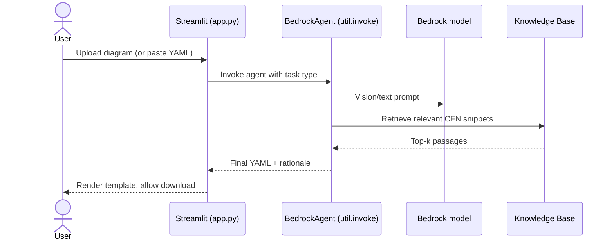

# Architecture

This document uses option (b) C4-style components with mermaid diagrams. The first diagram below is a compact C4 Context view rendered inline; deeper-level views are linked out to the existing image artifacts under `../blog-artifacts/` rather than re-drawn, keeping this file well under 200 lines.

## Overview

The repository is an AWS sample that turns an architecture diagram (a PNG/JPG uploaded by a user) into a CloudFormation template. A Streamlit web UI accepts the image and forwards it to Amazon Bedrock Agents, which orchestrate calls to a vision-capable Bedrock model and to a Bedrock Knowledge Base backed by Amazon OpenSearch Serverless. The final YAML template is returned to the user through the UI.

```mermaid
C4Context
    title System Context — architecture-to-cloudformation-agents
    Person(user, "User", "Uploads an architecture diagram and downloads a CloudFormation template")
    System_Boundary(app, "architecture-to-cloudformation-agents") {
        System(streamlit, "Streamlit App", "app.py — UI and orchestration")
        System(invoke, "Bedrock Invocation Layer", "util.invoke: Bedrock, BedrockAgent, KnowledgeBase")
    }
    System_Ext(bedrock, "Amazon Bedrock", "Foundation models + Agents")
    System_Ext(kb, "Bedrock Knowledge Base", "Backed by OpenSearch Serverless")
    System_Ext(cfn, "AWS CloudFormation", "Deploys the supporting stacks")
    Rel(user, streamlit, "Uploads diagram, receives YAML")
    Rel(streamlit, invoke, "Python calls")
    Rel(invoke, bedrock, "InvokeModel / InvokeAgent")
    Rel(invoke, kb, "Retrieve / Ingest")
    Rel(cfn, app, "Provisions the runtime infrastructure")
```

A higher-fidelity rendering of the same picture lives at [`../blog-artifacts/Overview of Pattern.png`](../blog-artifacts/Overview%20of%20Pattern.png).

## Components

The system is composed of four working components. The same list is referenced from `CONTRIBUTING.md` as the working definition of "component" for review purposes.

1. **Streamlit app** — `agents-architecture-to-cloudformation/app.py`. The single user-facing entry point. Parses CLI args (`--environmentName`, `--GitURL`), renders the upload form, and wires everything below it together. Packaged via the local `Dockerfile`.
2. **Bedrock invocation layer** — `agents-architecture-to-cloudformation/util/invoke/`. Exposes three classes used by the UI:
   - `Bedrock` — thin wrapper around the vision-capable foundation model used to read the uploaded diagram.
   - `BedrockAgent` — orchestrates a Bedrock Agent that drives the generate / update / validate flows.
   - `KnowledgeBase` — CRUD against the Bedrock Knowledge Base.
3. **Knowledge Base** — a Bedrock Knowledge Base whose vector store is an Amazon OpenSearch Serverless collection. Source documents live under `agents-architecture-to-cloudformation/data/ingest/`. See [`../blog-artifacts/knowledgebase.png`](../blog-artifacts/knowledgebase.png).
4. **CloudFormation stacks** — `agents-architecture-to-cloudformation/cfn_stack/`. Six templates that together provision the runtime: `parameter-stack.yaml`, `opensearch-serverless-stack.yaml`, `kb-stack.yaml`, `agents-stack.yaml`, `infrastructure.yaml`, and `development.yaml`.

Supporting modules under `util/` (`agent/`, `assets/`, `prompt_templates/`, `vector_store/`) are implementation details of the four components above and are not separately reviewable boundaries for the purposes of this document.

## Data Flow

There are three end-to-end flows. Each starts at the Streamlit UI, calls the BedrockAgent, optionally reads or writes the Knowledge Base, and returns a CloudFormation YAML template.

| Flow | Trigger | Diagram |
|---|---|---|
| Generate | New diagram uploaded; no prior template | [`../blog-artifacts/data-flow-generate-cloudformation.png`](../blog-artifacts/data-flow-generate-cloudformation.png) |
| Update | New diagram uploaded with an existing YAML attached | [`../blog-artifacts/data-flow-update-cloudformation.png`](../blog-artifacts/data-flow-update-cloudformation.png) |
| Validate | YAML pasted in for static review | [`../blog-artifacts/data-flow-validate-cloudformation.png`](../blog-artifacts/data-flow-validate-cloudformation.png) |

A compact, format-agnostic mermaid view of the common shape:



## Deployment

The supporting AWS infrastructure is deployed as a stack of CloudFormation templates under `agents-architecture-to-cloudformation/cfn_stack/`. They must be deployed in dependency order:

1. `parameter-stack.yaml` — shared SSM parameters consumed by later stacks.
2. `opensearch-serverless-stack.yaml` — the OpenSearch Serverless collection that backs the Knowledge Base.
3. `kb-stack.yaml` — the Bedrock Knowledge Base on top of the collection.
4. `agents-stack.yaml` — the Bedrock Agents that drive generate/update/validate.
5. `infrastructure.yaml` — networking and IAM glue.
6. `development.yaml` — developer-facing resources used during iteration.

The Streamlit application itself runs as a container built from the local `Dockerfile` (Python 3 base, dependencies from `requirements.txt`). It is launched per the command in [`../README.md`](../README.md). All components are stateless except the Knowledge Base; ingest content lives under `data/ingest/` and is loaded into the KB at deploy time.
